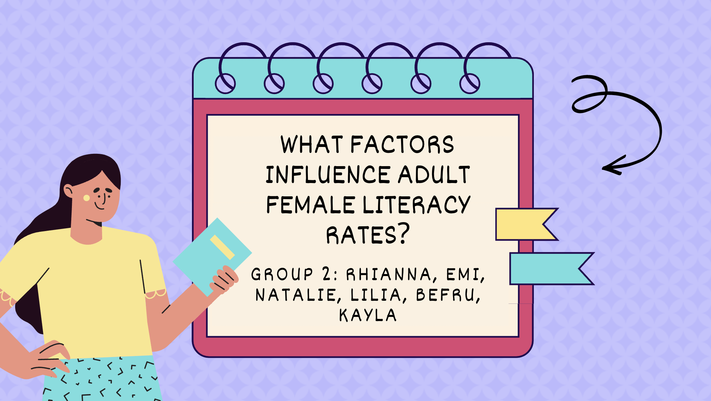

# Factors Contributing To Female Literacy Rates

This project will look at some key factors that contribute to female literacy rates with focus on Top 5 countries vs Bottom 5 countries from the years 2000-2021.

##### _"When You Educate A Girl You Educate A Nation"_

## Table of Contents
1. Project work document
*   Introduction
*   Background
*   Steps and Specifications
*   Implementation and Execution
*   Result Reporting
*   Conclusion
*   [View document](https://github.com/nf-97/literacy-project/blob/to-be-marked/other-project-docs/Project%20Report%20-%20Female%20Literacy.docx)

2.  Project activiy log
*   [View document](https://github.com/nf-97/literacy-project/blob/to-be-marked/other-project-docs/Project%20Activity%20Log%20(Female%20Literacy).xlsx)

3.  Adding, cleaning and visualising datasets  

Run the notebooks in this order:
####    Female Literacy Dataset
*   Added and explored unclean literacy dataset (csv)
*   Cleaned the dataset 
*   Created visualisations 
*   Worked out the median and mean of the data
*   Created a table with mean of top and bottom 5 countries
*   Saved cleaned dataset as a new csv
*   [View document](https://github.com/nf-97/literacy-project/blob/to-be-marked/jupyter-notebooks-data-files/1.adult-female-literacy-dc.ipynb)
####    Child Marriage Dataset
*   Added and explored unclean child marriage dataset (xslx)
*   Cleaned the dataset 
*   Calculated Mean and Median of the dataset
*   Visualised the data
*   Merged median child marriage dataset with mean Female literacy dataset
*   Added clean marriage dataset as csv
*   [View document](https://github.com/nf-97/literacy-project/blob/to-be-marked/jupyter-notebooks-data-files/2.child-marriage-dc.ipynb)

####    World Income Level Classifications
*   Read in data through API 
*   Data opens as a 6 page JSON file 
*   Converted JSON to dataframe for Jupyter Notebook
*   Read in merged child marriage and Female literacy dataset (csv)
*   Merged Income Level Classifications for Top and Bottom 5 countries
*   Saved merged table as csv
*    [View document](https://github.com/nf-97/literacy-project/blob/to-be-marked/jupyter-notebooks-data-files/3.income-level-api-dc%20.ipynb)

####    Share of Education in Government Expenditure
*   Read in and explored the data (csv)
*   Filtered and cleaned the dataset
*   Calculated Median and Mean of govt expenditure for top and bottom 5 countries
*   Visualised the data
*   Added mean value to merged table dataset
*   Saved new merged table csv
*    [View document](https://github.com/nf-97/literacy-project/blob/to-be-marked/jupyter-notebooks-data-files/4.share-of-education-in-govtexp-dc.ipynb)

####   Global Peace Index Dataset
*   Added and explored unclean dataset (xlsx)
*   Cleaned the dataset
*   Read in merged table dataset and matched countries in the table
*   Merged with other merged table dataset
*   Visualised the data
*   Saved new merged table csv
*    [View document](https://github.com/nf-97/literacy-project/blob/to-be-marked/jupyter-notebooks-data-files/5.GPI-dc.ipynb) 

3.  Regression Analysis
*   Read in the merged table with all the variables
*   Declared Dependent and Independent variables
*   Made all variables numeric
*   Non numeric variables were assigned dummy variables
*   Run, visualise and interpret regression analysis.
*   [View document](https://github.com/nf-97/literacy-project/blob/to-be-marked/jupyter-notebooks-data-files/7.regression-results.ipynb)

         
## Authors

- [@nf-97](https://github.com/nf-97)
- [@kaylalo](https://github.com/Kaylalo)
- [@EmiAwo](https://github.com/EmiAwo)
- [@Lilymn9](https://github.com/Lilymn9)
- [@rhikye](https://github.com/rhikye)
- [@befrup](https://github.com/befrup)

## Acknowledgements

 Thank you [Code First Girls](https://codefirstgirls.com/) for this opportunity and for their commitment to helping women learn. Special thanks to our sponsors for making this possible and to our tutors and big shout out to all the authors of the project.
